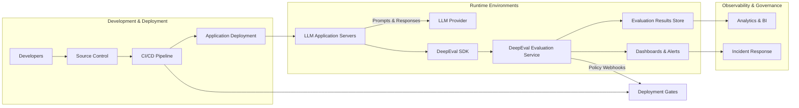

Once DeepEval is installed across your evaluation environments, the platform typically slots into an existing large language model (LLM) delivery stack. The following diagram highlights the major components and data flows required to capture prompts, execute DeepEval checks, and feed the resulting metrics back into deployment and monitoring workflows.

### How the pieces fit together

- **Development & deployment**: Engineers push evaluation-aware code through version control and the CI/CD pipeline. DeepEval policies can surface quality regressions before release via deployment gates.
- **Runtime instrumentation**: Each application server communicates with both its configured LLM provider and the local DeepEval SDK. Prompt/response payloads and runtime metadata are captured automatically.
- **DeepEval services**: The managed or self-hosted DeepEval service aggregates evaluations, stores results, and emits dashboards plus alert notifications.
- **Observability & governance**: Evaluation stores feed into downstream analytics, while alerts trigger on-call workflows to keep LLM quality aligned with SLAs.
